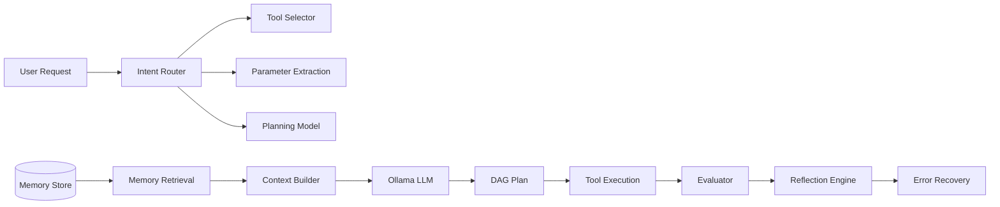

# AI Models

## Overview

Veyron uses a hybrid micro-model architecture: lightweight scikit-learn models for deterministic classification/retrieval tasks, paired with an external LLM (Ollama) for generative tasks (planning, reflection, response generation).

## Architecture Diagram

## Model Inventory

### Intent Router

- **Purpose**: Classify user requests into task categories
- **Architecture**: Multi-output classification (TF-IDF → LogisticRegression per label)
- **Labels**: 10 categories (file_operation, code_generation, data_analysis, system_monitoring, etc.)
- **Dataset**: 5000 synthetic examples
- **Training**: scikit-learn pipeline with grid search
- **Evaluation**:
  - Synthetic benchmark: 98.51% overall accuracy
  - Real-world validation: ~60% accuracy
  - **Explanation of gap**: Distribution shift — synthetic data (generated from templates) does not capture the full variability, ambiguity, and typos of real user language. Real requests contain contextual references, partial sentences, and domain-specific phrasing absent from the synthetic set.
- **File**: `intent_router.pkl` (~950 KB)
- **Runtime**: `intent_router/inference.py`

### Tool Selector

- **Purpose**: Predict which tool a task requires
- **Architecture**: TF-IDF + LogisticRegression
- **Accuracy**: precision@1 = 0.970, recall@1 = 0.940
- **Categories**: 10 tool categories
- **File**: `tool_selector.pkl` (~38 KB v1 / ~378 KB v2)

### Memory Retrieval

- **Purpose**: Retrieve relevant past task context
- **Architecture**: TF-IDF vectorization + cosine similarity + reranking
- **Improvements**:
  - MRR: 0.0253 → 0.3972 (15.7x improvement)
  - Precision@1: 0.0253 → 0.2828 (11.2x improvement)
- **File**: `memory_retrieval.pkl` (~32 KB)

### Error Recovery

- **Purpose**: Classify runtime errors for automatic recovery
- **Architecture**: TF-IDF + LogisticRegression
- **File**: `error_recovery.pkl` (~15 KB)

### Planning Necessity Model

- **Purpose**: Binary classification — does a task need planning?
- **File**: `planning.pkl`

### Parameter Extraction (Phase 11)

- **Purpose**: Extract structured parameters from natural language
- **Architecture**: TF-IDF + per-parameter LogisticRegression classifiers
- **File**: `parameter_extraction.pkl` (~10 MB)

## Training Pipeline

- Data collection from task history
- Dataset validation, splitting, formatting
- v1 vs v2 training pipeline (v2 uses unified pipeline with versioning)
- Benchmark framework (v2 vs v1 vs heuristic comparison)
- 8–9x latency improvement in v2 vs v1

## Model Registry

- Lifecycle: register → promote → rollback
- Automatic retraining trigger (dataset growth detection)
- Benchmark regression detection
- Promotion guard

## Limitations

- Synthetic→real accuracy gap
- No continuous online learning
- Models are static between retraining runs
- Parameter extraction is the largest model (~10 MB) and least validated
