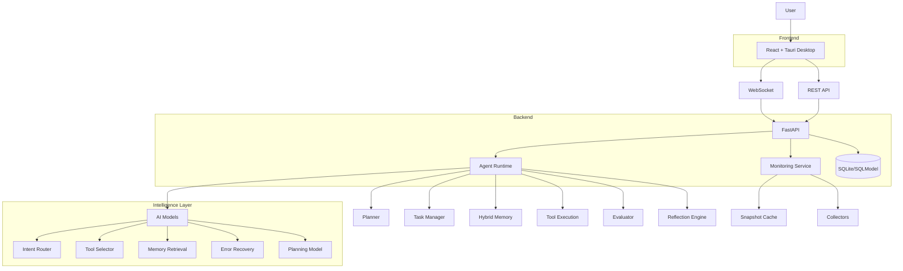
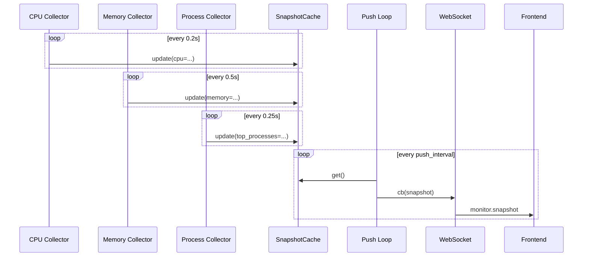
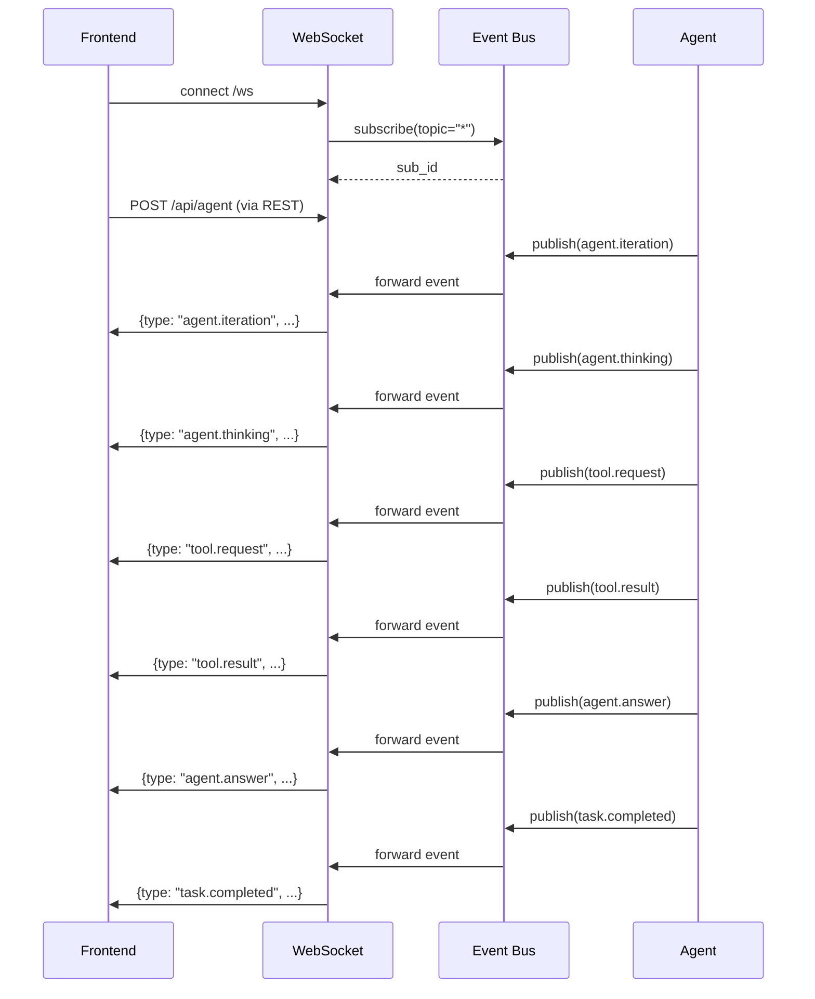
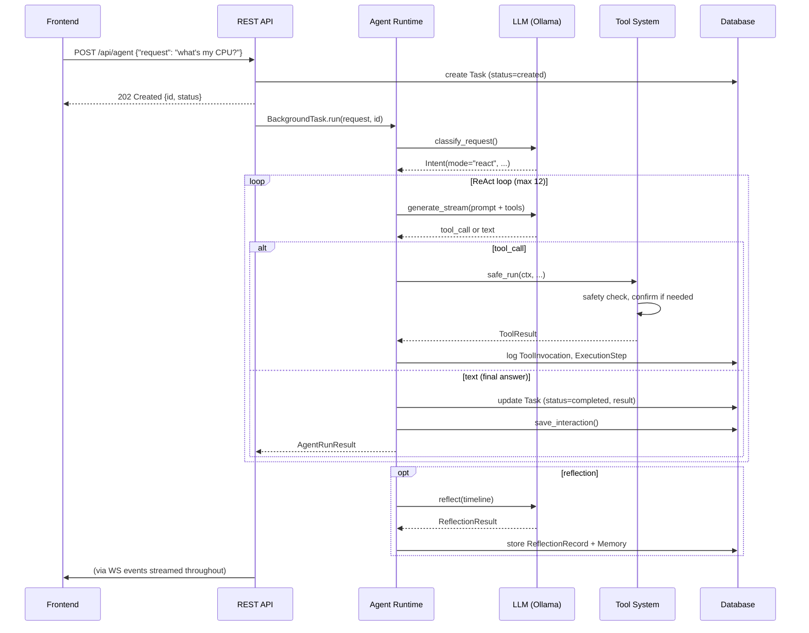

# Veyron — Architecture

**AI Productivity System.** A local-first agent runtime with memory, tools, micro-model intelligence, and a mission-control desktop UI.

This document is the authoritative implementation reference. Every statement is derived from the codebase at `backend/veyron/` and `frontend/src/`. If this document disagrees with earlier documentation, trust the code.

---

## 1. System Overview

Veyron follows a **three-layer architecture**: a React + Tauri frontend (UI), a FastAPI backend (runtime), and an intelligence layer (micro-models). Communication occurs via REST and WebSocket over localhost.



### Design Principles

1. **Intelligence first, UI second** — The AI Core (agent + planner + memory) is the only component that reasons. The frontend, tools, and database are services it talks to through defined interfaces.
2. **Modular by construction** — Every capability sits behind an interface (`LLMProvider`, `Tool`, `PluginBase`). The agent never imports a concrete provider or tool class directly. Adding a feature means adding a class; the agent never changes.
3. **Security by default** — Path validation, command classification, permission levels, user confirmation, and append-only audit logging wrap every privileged action.
4. **Real measurements only** — Every system metric, file read, and command output comes from an actual measurement. No fake data.
5. **Local-first, offline capable** — The entire system runs on localhost with Ollama. A remote LLM provider (OpenAI-compatible) is available as a configurable fallback.

---

## 2. Frontend Layer

### Stack

- **React 18** with TypeScript
- **Vite 5** build tool
- **Tailwind CSS 3** for styling
- **Zustand 4** for state management
- **React Router 6** for page routing
- **Tauri 2** desktop shell (Rust side)

### Component Tree

```
App
├── TauriBridge (manages Tauri events, backend lifecycle)
├── Layout (sidebar + main content)
│   ├── Sidebar (navigation)
│   └── Main Content (page routing)
└── Pages
    ├── Dashboard           — system overview, recent tasks
    ├── AgentWorkspace      — chat-like agent interaction
    ├── TaskRegistry        — list + filter all tasks
    ├── TaskDetail          — single task timeline + execution view
    ├── ToolCenter          — tool listing, schemas, recent invocations
    ├── SystemIntelligence  — live CPU/memory/disk/process monitoring
    ├── ProjectIntelligence — project analysis (tech detection, deps)
    ├── MemoryCenter        — memory CRUD, search, import/export
    ├── LearningDashboard   — skills, workflows, benchmarks, reflections
    ├── Diagnostics         — backend health, WS status, config viewer
    └── Settings            — LLM provider, model selection, security
```

### State Management (Zustand)

The `appStore` (`frontend/src/stores/appStore.ts`) holds all global state:

| Slice | Purpose |
|-------|---------|
| `connection` | Multi-axis connection state (backend running, health, REST, WebSocket) |
| `events` | Global WebSocket event log (capped at 400) |
| `taskEvents` | Per-task event logs (capped at 300 per task) |
| `taskBriefs` | Lightweight task cache by `public_id` |
| `confirmations` | Pending user approval requests (tool confirmations) |
| `toasts` | UI notification queue (auto-dismiss after 4.2s) |
| `systemSnapshot` | Latest system monitoring snapshot from WebSocket push |

The store auto-derives the `connection` state from four boolean flags (`backendRunning`, `healthOk`, `restOk`, `wsConnected`). Only when all four are true is the connection considered `connected`.

A second store (`updateStore`) manages the Tauri updater state machine (idle / checking / available / downloading / installed / failed).

### WebSocket Client (`frontend/src/api/websocket.ts`)

- Connects to `ws://127.0.0.1:8000/ws` (Tauri) or `{protocol}://{host}/ws` (browser).
- Auto-reconnects every 3 seconds on disconnect.
- Registers event handlers via `onEvent()` — returns an unsubscribe function.
- Supports `subscribe(topic)` and `unsubscribe(topic)` for per-task event filtering.
- The client subscribes to `monitor.snapshot` events on connect and writes system data into the Zustand store.

### API Client (`frontend/src/api/client.ts`)

- Typed REST client covering all backend endpoints.
- In Tauri mode, routes requests through `@tauri-apps/api/core.invoke('http_fetch', ...)` to bypass CORS. In browser dev mode, uses the Vite proxy (`/api` → `localhost:8000`).
- **Retry with exponential backoff** — up to 3 retries with `min(1000 * 2^attempt, 4000)` ms delay. Only retries on network errors; 4xx/5xx responses throw `ApiError` immediately.
- Captures `RequestMetrics` (method, URL, status, latency, error, retries) and maintains a rolling history of 20 entries for diagnostics.
- All paths are relative to `/api` in dev mode, and resolve to `http://127.0.0.1:8000/api` in Tauri.

### Page Routing

| Path | Page Component |
|------|----------------|
| `/` | DashboardPage |
| `/agent` | AgentWorkspacePage |
| `/tasks` | TaskRegistryPage |
| `/agent/:id` | TaskDetailPage |
| `/tools` | ToolCenterPage |
| `/projects` | ProjectIntelligencePage |
| `/memory` | MemoryCenterPage |
| `/system` | SystemIntelligencePage |
| `/learning` | LearningDashboardPage |
| `/diagnostics` | DiagnosticsPage |
| `/settings` | SettingsPage |

---

## 3. Backend Core

### 3.1 FastAPI Application (`backend/veyron/main.py`)

The application runs under uvicorn as an ASGI server. `create_app()` builds the FastAPI instance with:

- **Lifespan handler** — initializes logging, database (SQLModel), event bus, confirmation manager, tool registry, intelligence scheduler, and LLM diagnostics.
- **Middleware stack** (outermost first):
  - `AuthMiddleware` — bearer token check. When `api_auth_token` is `None` (dev mode), all requests pass unauthenticated. Uses `hmac.compare_digest` for constant-time comparison. `/api/health` and `/api/info` are exempt.
  - `RateLimitMiddleware` — 120 requests/minute per IP using an in-memory sliding window.
  - `RequestIDMiddleware` — injects `X-Request-ID` header (UUID) into every request for tracing.
  - `CORSMiddleware` — configured from `server.cors_origins` (default: `localhost:5173`, `tauri://localhost`, `https://tauri.localhost`).

### 3.2 Configuration (`backend/veyron/config.py`)

Four-level configuration hierarchy (highest precedence first):
1. Environment variables (`VEYRON_*`, `__` for nesting, e.g. `VEYRON_SERVER__HOST`)
2. `.env` file (project root)
3. `config.yaml` (project root)
4. Built-in defaults

```python
class Settings(BaseSettings):
    security: SecurityConfig    # sandbox roots, approval mode, timeouts
    model: ModelConfig          # Ollama URL, base model, micro-models
    monitor: MonitorConfig      # collector intervals, push rate
    server: ServerConfig        # host, port, CORS, auth token
    environment: str            # "dev" | "prod"
    database_url: str           # sqlite:///backend/data/veyron.db
```

### 3.3 Agent Runtime (`backend/veyron/core/agent.py`)

The `Agent` class is **stateless between runs**. All state lives in the `Task` DB table.

- `run(request, task_public_id)` — entry point. Enforces a 300-second wall-clock timeout via `asyncio.wait_for`. Returns `AgentRunResult`.
- `_run_with_timeout()` — classifies intent via `classify_request()`, then routes to `_run_react()` or `_run_planner()`.
- `_run_react()` — standard ReAct loop up to `max_iterations` (default 12). Each iteration:
  1. Publish `agent.iteration` event.
  2. Save checkpoint to DB.
  3. `_generate()` — calls `provider.generate_stream()` with tool schemas. Accumulates text deltas, emits `agent.thinking` events every ~40 chars.
  4. If a tool call is returned: validate tool exists, create `ToolContext`, call `tool.safe_run()`, publish `tool.result`, append to message history.
  5. If no tool call: treat accumulated text as the final answer, publish `agent.answer`, persist, save interaction, trigger reflection.
  6. If max iterations reached: publish `agent.exhausted`, persist failure.
- `_run_planner()` — delegates to `Planner.plan_and_execute()`.
- `cancel()` — adds task to cancellation set. Background reflection is also cancelled.
- `_save_interaction()` — serializes a `UserInteraction` record to daily JSONL file. Captures timeline, quality score, latency breakdown, and router confidence.
- `_maybe_reflect()` — schedules background reflection. Always runs on failure; samples at `reflection_sample_rate` (default 0.2) on success.

### 3.4 Task Manager (`backend/veyron/core/task_manager.py`)

Long-lived task state machine backed by the `Task` table.

```
States: CREATED → RUNNING → COMPLETED / FAILED / CANCELLED / PAUSED
               ↘ PLANNING → RUNNING
                          ↘ VERIFYING → RUNNING / COMPLETED / FAILED
```

- `create_task()` — generates a UUID `public_id`, inserts a `Task` row with status `CREATED`.
- Provides `list_tasks()`, `cancel_task()`, `pause_task()`, `resume_task()`, `delete_task()`.
- Uses sync DB queries directly to avoid circular dependencies.
- `get_task()` returns a `TaskInfo` with progress summary (step counts from `ExecutionStep` table).

### 3.5 DAG Planner (`backend/veyron/core/planner.py`)

Decomposes complex requests into a dependency graph of steps.

**Plan Generation:** Prompts the LLM with a structured planner prompt listing available tools. Parses the response — first attempts JSON array of step objects with `id`, `goal`, `tool`, `depends_on` fields; falls back to numbered list parser.

**Validation:** Rejects empty plans, detects circular dependencies (DFS), detects references to non-existent step IDs.

**DAG Execution:** Maintains a set of remaining steps. At each cycle, identifies steps whose dependencies are all satisfied and executes ready steps in parallel via `asyncio.gather()`. On failure:
- < 3 failures: `_repair_step()` — asks the LLM to generate a replacement.
- ≥ 3 failures: marks plan as failed, triggers full adaptive replan.

**Verification:** Each step's output is checked against its goal using a separate LLM call (verifier prompt). Returns `VerifierResult` with status (`PASS`/`FAIL`/`UNCERTAIN`), confidence, issues, evidence, and recommended action (`COMPLETE`/`RETRY`/`REPLAN`/`HUMAN_REVIEW`).

**Synthesis (`_synthesize`):** Combines all step results into a final response using an LLM call with the synthesis prompt.

### 3.6 Context Manager (`backend/veyron/core/context.py`)

Builds the message list sent to the LLM each turn.
- `build_system_prompt()` — assembles tool schemas as bullet points with parameter details. Injects relevant memories via `MemoryStore.build_context()`.
- `initial_messages()` — returns `[system prompt, user request]`.
- `trim_history()` — keeps the conversation bounded at 24 messages. Always keeps the system prompt and the latest user message.

### 3.7 Event Bus (`backend/veyron/core/events.py`)

In-process async pub/sub.
- `EventBus` manages subscriptions as async iterators. Each subscriber gets an `asyncio.Queue`.
- `publish(event)` — async, awaits all subscribers receiving the event.
- `publish_nowait(event)` — fire-and-forget for non-critical events.
- `subscribe(topic=None)` — returns a `(sub_id, async_iterator)`. `topic=None` subscribes to all events.
- Events have `type`, `topic`, `ts`, `payload`. Topics are typically task `public_id` or `"system"`.
- The WebSocket endpoint subscribes to the bus on connect and forwards events to the client.

### 3.8 Execution Tracker (`backend/veyron/core/tracker.py`)

Async tracker that records steps, checkpoints, and task progress to the DB during agent execution. Uses `async_session_scope()` and `select()` style queries. Logs every `ExecutionStep` (LLM calls, tool calls, plan steps) with timestamps, duration, input/output previews, and error details.

### 3.9 Reflection Engine (`backend/veyron/core/reflection.py`)

Post-task analysis.
- `Reflect()` — loads task timeline from the tracker, formats it as a structured prompt, calls the LLM to analyse the task, and returns a `ReflectionResult` with confidence scores, mistake/improvement counts, and free-form notes.
- `store_reflection_memories()` — stores the analysis as a `ReflectionRecord` in the DB and creates `Memory` records with category `REFLECTION`.

### 3.10 Monitoring Service (`backend/veyron/monitor/service.py`)

Continuously collects system metrics via dedicated collector functions, each running in its own asyncio task at its own configurable interval. Results are written to a shared `SnapshotCache` which REST endpoints and WebSocket push tasks read from.

**Collectors** (defined in `monitor/collectors.py`):

| Collector | Interval | Data Source |
|-----------|----------|-------------|
| CPU | 0.2s | psutil CPU-time deltas, per-core breakdown, frequency, load average |
| Memory | 0.5s | RAM + swap (total, used, available, percent) |
| Processes | 0.25s | Top-N (30) processes by CPU, with delta computation per PID |
| Disks | 1.0s | All partitions (device, mount, fstype, usage) |
| Network | 0.5s | I/O counters + per-second rates |
| Temperatures | 1.0s | Hardware sensors (if supported) |
| GPU | 5.0s | GPU presence detection |

**Collector isolation** — if one collector fails, the error is logged and it waits for the next interval. Other collectors are unaffected.

**Snapshot Cache** (`monitor/cache.py`):
- Thread-safe `SnapshotCache` using a frozen `SystemSnapshot` dataclass.
- `update(**kwargs)` — atomic field replacement via `dataclasses.replace()` under a lock.
- `get()` — lock-free read (GIL-safe on CPython).
- `reset()` — returns to empty snapshot.

**WebSocket Push** — when `push_interval > 0`, a background task reads the cache and pushes the snapshot to the WebSocket callback every `push_interval` seconds (default 0.2s). The frontend receives `monitor.snapshot` events and updates the system dashboard in real time.



### 3.11 Async Runtime

- **Database Engines** — `sqlite+aiosqlite://` (async, used by agent/tracker/monitor) and `sqlite://` (sync, used by tools/task manager/memory/security/training). Both share the same `veyron.db` file with WAL mode and 5s busy timeout.
- **Background Tasks** — Agent runs via FastAPI's `BackgroundTasks`. The intelligence scheduler runs as a long-lived `asyncio.Task`. Training is spawned as a subprocess. Reflection runs as `asyncio.create_task`.
- **Event Loop** — `_generate()` is fully async (streams from Ollama). Tool execution uses `asyncio.wait_for` for timeouts. Confirmation manager awaits user response on an `asyncio.Future` (120s timeout).

---

## 4. Intelligence Layer (Micro-Models)

### 4.1 Model Registry (`backend/veyron/intelligence/models/registry.py`)

The `ModelRegistry` manages model lifecycle via a JSON file (`data/models/model_registry.json`):

| Method | Description |
|--------|-------------|
| `register(metadata)` | Adds a new model entry |
| `promote(model_type, version)` | Sets model to production; previous production becomes `deprecated` |
| `rollback(model_type, version)` | Reverts a candidate to production |
| `get_production(model_type)` | Returns current production model metadata |
| `list_models()` | Returns all registered models |
| `load_production_model(model_type)` | Loads and returns the scikit-learn Pipeline object |

A parallel `ModelVersion` SQLModel table stores version history for programmatic queries.

### 4.2 Micro-Model Inventory

All models are scikit-learn `Pipeline` objects (typically `TfidfVectorizer + LogisticRegression`) serialized via pickle. Each sub-package follows the same structure: `dataset.py`, `model.py`, `trainer.py`, `inference.py`.

| Model | Package | Purpose | Input | Output | Training Data |
|-------|---------|---------|-------|--------|---------------|
| **Intent Router** | `intent_router/` | Classifies request intent | Request text | Intent category + confidence | Synthetic + real corrections + LLM-generated |
| **Tool Selector** | `tool_selector/` | Predicts relevant tools | Request text | Tool names with scores | Synthetic + real corrections + LLM-generated |
| **Planning Model** | `planning/` | Predicts if request needs planning | Request text + intent category | `requires_plan` bool + `estimated_steps` + confidence | Synthetic |
| **Memory Retrieval** | `memory_retrieval/` | Reranks memory search results | Query + candidate texts | Ranked indices | Synthetic |
| **Error Recovery** | `error_recovery/` | Classifies error patterns | Error text + context | Error category + recovery strategy | Synthetic |

**Performance (benchmarked):**
- Intent Router: 98.5% accuracy on synthetic data, ~60% on real-world requests
- Tool Selector: precision@1 = 0.970
- Memory Retrieval: TF-IDF + cosine similarity + model reranking

### 4.3 Inference and Runtime Integration

**Intent Router** (`core/intelligence.py:classify_request`):
1. Loads production intent classifier and tool selector from the Model Registry.
2. Calls `intent_router.inference.predict(request)` → category + confidence.
3. Calls `tool_selector.inference.predict(request)` → predicted tool list.
4. Returns `Intent(mode, domain, confidence, predicted_tools, intent_category)`.
5. Falls back to keyword heuristics if models are unavailable or disabled.

**Tool Filtering** — if `filter_tools_by_prediction` is enabled and predicted tools are non-empty, only schemas for predicted tools are included in the LLM prompt. Reduces token consumption by 50–80%.

**Observability** (`intelligence/observability.py`):
- `log_prediction()` writes every inference to the `PredictionLog` table with model name, version, input, output, confidence, latency, and `needs_review` flag (set when confidence < 0.6).

### 4.4 Training Pipeline (`backend/veyron/intelligence/training/run_training.py`)

Entry point: `run_training()`.

1. **Dataset loading** — loads synthetic data from `data/training/synthetic_training_data.jsonl`, merges real corrections from `PredictionLog` (human-corrected predictions), merges LLM-generated data from `data/training/llm_generated_intents.jsonl`.
2. **Deduplication** — by content hash across all sources.
3. **MLflow setup** — tracking URI: `sqlite:///mlflow.db`, experiment: `veyron_intelligence`.
4. **Intent classifier training** — via `TrainingPipelineV2.train_intent()`. Logs params (dataset hash, version, seed) and metrics (accuracy, macro_precision, macro_recall, macro_f1, avg_confidence).
5. **Tool selector training** — via `TrainingPipelineV2.train_tool_selector()`. Logs params and metrics (precision@1, precision@3, recall@1, recall@3, f1@3, exact_match_rate).
6. **Auto-promotion** — compares new model vs current production on primary metric. Promotion gate: `new_score > current_score + improvement_threshold` (default +0.01). Primary metrics: `macro_f1` (intent), `precision_at_1` (tool_selector).
7. **Artifacts** — saves `.pkl` model files, evaluation reports (JSON), training metadata JSON, VERSION file.

### 4.5 Intelligence Scheduler (`backend/veyron/intelligence/scheduler.py`)

Background retraining loop running at a configurable interval (default 300s). Each cycle:
1. Loads user interactions from daily JSONL files.
2. Checks if dataset has grown by > `retrain_min_growth_pct` (default 10%) since last training.
3. If triggered: acquires a file lock, spawns training as a subprocess (`subprocess_train.py`), logs output to `data/logs/training_output.log`.
4. Runs an **auto-improvement cycle** in parallel every hour: skill detection, memory health maintenance, dataset quality assessment.

### 4.6 MLflow Integration

- Tracking URI: `sqlite:///mlflow.db`
- Experiment: `veyron_intelligence`
- Each training run creates two MLflow runs under the same experiment (intent classifier + tool selector)
- Logged metrics: accuracy, macro_precision/recall/f1, avg_confidence, precision@1/3, recall@1/3, exact_match_rate
- Promotion decisions logged as custom metrics (`promoted_to_production`, `macro_f1_improvement`, etc.)
- Model `.pkl` files logged as MLflow artifacts under `model/` artifact path

### 4.7 Active Learning

- Every agent interaction saved to daily JSONL via `save_user_interaction()`.
- Supports `feedback_score` (0.0–1.0) via `POST /api/agent/{id}/feedback`.
- When feedback < 0.5, related `PredictionLog` records are flagged for review.
- Scheduler retrains when dataset grows by > 10%.

---

## 5. Storage Layer

### 5.1 SQLite + SQLModel (14 tables)

Schema created by `init_db()` on startup via `SQLModel.metadata.create_all()`. No migration tooling — schema changes are additive (new columns with nullable defaults are auto-created).

| Table | Purpose | Key Fields |
|-------|---------|------------|
| `Task` | Agent task lifecycle | public_id, status (enum), mode, result, error, checkpoint, timestamps |
| `Memory` | Long-term memory | public_id, category (enum), content, importance, quality scores, decayed, content_hash |
| `AuditEvent` | Append-only security trail | action, subject, permission, inputs, outcome, reason |
| `ToolInvocation` | Per-tool-call log | tool_name, permission, inputs, result, ok, duration_ms, error |
| `ExecutionStep` | Step-level tracking within tasks | step_type (enum), name, status, timestamps, duration, retry_count |
| `EvaluationMetric` | Stored evaluation run metrics | task_id, category, success, duration, tool_calls, retries, error |
| `ReflectionRecord` | Post-task reflection analysis | task_public_id, category, confidence, quality scores, mistake/improvement counts |
| `Workflow` | Reusable workflow definitions | name, version, tags, step_count, use_count, success_rate |
| `WorkflowStepModel` | Steps within a workflow | step_type, tool_name, params_json, condition, retry_count, failure_policy |
| `Skill` | Detected skills from usage patterns | name, pattern_steps (JSON), frequency, confidence |
| `PluginRegistration` | Persisted plugin metadata | name, version, author, tool_names, command_names, enabled |
| `LearningEvent` | Audit trail for learning system | event_type, category, summary, details_json |
| `BenchmarkResult` | Full benchmark task results | task_id, category, success, plan/memory/tool/performance metrics |
| `BenchmarkRun` | Benchmark execution records | benchmark_name, model_type/version, score, regressions |
| `ModelVersion` | Trained model version history | model_type, version, status, dataset_size, metrics_json, path |
| `PredictionLog` | ML prediction observability | model_name, input, output, confidence, latency, needs_review |
| `FailureAnalysisRecord` | Categorized failure records | task_public_id, failure_category (enum), error_message, recovered |
| `ToolStats` | Per-tool reliability statistics | total_executions, success_rate, avg_latency, reliability_score |
| `RegressionRecord` | Regression detection records | baseline/current run_id, metric_name, delta, severity |

### 5.2 Relationship Diagram

```
Task ──< ExecutionStep
Task ──< ToolInvocation
Task ──< ReflectionRecord
Task ──< EvaluationMetric
Task ──< FailureAnalysisRecord
Task ──< Memory (via source_task)

Workflow ──< WorkflowStepModel
Workflow ──< Skill (via suggested_workflow)

BenchmarkRun ──< BenchmarkResult
BenchmarkRun ──< RegressionRecord

Memory ──< Memory (via merge/duplicate chain)

PluginRegistration (standalone)
LearningEvent (standalone)
ModelVersion (standalone)
PredictionLog (standalone)
ToolStats (standalone)
```

---

## 6. Security Layer

### 6.1 Path Policy (`backend/veyron/security/path_policy.py`)

- Validates all filesystem paths against configured sandbox roots.
- Decodes URL-encoded path characters (prevents `..` smuggling).
- Resolves symlinks (`resolve(strict=True)`) before checking containment.
- Returns a resolved `Path` on success; raises `PathPolicyError` on failure.

### 6.2 Command Policy (`backend/veyron/security/command_policy.py`)

- `classify_command(command)` → `FREE` / `CONFIRM` / `RESTRICTED`.
- FREE allowlist: read-only commands (`ls`, `cat`, `git status`, `ps`, `node --version`, etc.).
- RESTRICTED keywords: destructive commands (`rm`, `format`, `shutdown`, `sudo`, `kill -9`, `del`, etc.).
- Shell metacharacters (`;`, `|`, `&&`, `>`, backtick) in any command downgrade it to CONFIRM minimum.
- Input length capped at 4096 characters.

### 6.3 Confirmation Flow (`backend/veyron/security/confirmations.py`)

- `ConfirmationManager.request()` creates a `PendingConfirmation`, publishes a `security.confirm` event on the bus, and awaits an `asyncio.Future` (120s timeout → auto-deny).
- `respond()` resolves the pending confirmation. RESTRICTED actions require a `reason` string.
- Protected against unbounded growth (max 100 pending confirmations).

### 6.4 Safety Policy (`backend/veyron/security/safety.py`)

All tools pass through `SafetyPolicy.evaluate()` before execution:
1. Classifies risk level (`LOW` / `MEDIUM` / `HIGH` / `CRITICAL`) using tool defaults + operation keywords.
2. Applies approval mode (`AUTONOMOUS` / `CONFIRM` / `SAFE`).
3. Returns `(allowed, reason)`. Reason starts with `"confirm:"` if user approval is needed.

### 6.5 Audit Log (`backend/veyron/security/audit.py`)

- Append-only daily JSONL files: `data/audit/audit-YYYY-MM-DD.jsonl`.
- Thread-safe writes via `threading.Lock`.
- Every privileged action is recorded: action, subject, permission, inputs, outcome, reason, detail, timestamp.

### 6.6 API Authentication (`backend/veyron/api/auth.py`)

- `AuthMiddleware` checks `Authorization: Bearer <token>` against configured `api_auth_token`.
- When `api_auth_token` is `None` (default), all requests pass unauthenticated (dev mode).
- `/api/health` and `/api/info` are exempt.
- Uses `hmac.compare_digest` for constant-time token comparison.

---

## 7. Tool System

### 7.1 Tool Interface (`backend/veyron/tools/base.py`)

```python
class Tool(ABC):
    name: ClassVar[str]
    description: ClassVar[str]
    permission: ClassVar[PermissionLevel]  # FREE | CONFIRM | RESTRICTED
    Inputs: ClassVar[type[BaseModel]]      # Pydantic input schema
    max_retries: ClassVar[int]
    retry_delay_ms: ClassVar[int]
    timeout_ms: ClassVar[int]

    async def run(self, ctx: ToolContext, **inputs) -> ToolResult: ...
    async def safe_run(self, ctx, **inputs) -> ToolResult: ...
    @classmethod
    def schema_for_llm(cls) -> dict: ...
```

`safe_run()` is the caller-facing entry point:
1. Validates inputs against the Pydantic schema.
2. Evaluates safety policy (risk classification + permission check).
3. If CONFIRM or RESTRICTED: calls confirmation flow.
4. Executes `run()` with retry and timeout.
5. Returns `ToolResult(ok, output, data, error, duration_ms)`.

### 7.2 Registry (`backend/veyron/tools/registry.py`)

`ToolRegistry` auto-discovers all `Tool` subclasses via `pkgutil.iter_modules` on the `veyron.tools` package. Modules `base`, `registry`, and `__init__` are skipped. Lazy-initialized on first use (thread-safe with `threading.Lock`).

### 7.3 Built-in Tools

| Tool | Permission | Purpose |
|------|-----------|---------|
| `filesystem_read` | FREE | Read files, list directories, stat paths within sandbox roots |
| `system_monitor` | FREE | CPU, RAM, disk, processes, health via psutil |
| `terminal` | CONFIRM | Shell execution with per-command classification |
| `project_analyzer` | FREE | Technology detection, dependency parsing, issue analysis |

### 7.4 Reliability Layer

- **Retry** — configurable per tool (`max_retries`, `retry_delay_ms`).
- **Timeout** — configurable per tool (`timeout_ms`), enforced via `asyncio.wait_for`.
- **Failure categorization** — `classify_failure()` in `tools/base.py` maps error strings to `FailureCategory` enum values (timeout, permission, invalid_input, tool_error, network, unknown).

---

## 8. Evaluation System

### 8.1 Benchmark Runner (`backend/veyron/evaluation/evaluator_v2.py`)

The `BenchmarkRunner` executes a suite of benchmark tasks and collects comprehensive metrics across six dimensions:

| Dimension | Metrics |
|-----------|---------|
| Agent | success, iterations, tool_calls_count, retry_count, clarification_used, hallucination_detected |
| Planner | plan_length, unnecessary_steps, dependency_correctness, execution_order_score, replan_count |
| Memory | memories_retrieved, relevant_memories, precision, recall, latency |
| Tool | tools_selected, expected_tools_match, execution_latency, success_rate, retry_count |
| Performance | total_latency_ms, llm_latency_ms, planner_latency_ms, tool_latency_ms |
| Failure | failure_category, error_message |

Concurrent execution with semaphore (default max 3 concurrent tasks).

### 8.2 Failure Analysis (`backend/veyron/evaluation/failure_analysis.py`)

Automatic failure classification from error messages:
- Categories: `TIMEOUT`, `HALLUCINATION`, `PERMISSION_DENIED`, `INVALID_INPUT`, `MEMORY_FAILURE`, `PLANNER_FAILURE`, `LLM_ISSUE`, `ENVIRONMENT_ISSUE`, `UNKNOWN`
- Keyword-based classifier with tool-level fallback
- Records stored in `FailureAnalysisRecord` table with recovery tracking

### 8.3 Regression Detection (`backend/veyron/evaluation/regression.py`)

Compares benchmark runs against baselines:
- Configurable thresholds per metric (e.g., success_rate ≥ 0.05 delta, latency ≥ 500ms)
- Severity: `info` / `warning` / `critical`
- Records stored in `RegressionRecord` table

### 8.4 Tool Intelligence (`backend/veyron/evaluation/tool_intelligence.py`)

Per-tool reliability tracking:
- Records every execution with success/failure and latency
- Computes `reliability_score` (0.0–1.0) based on success rate (70% weight), recency penalties, and volume bonuses
- Tracks common failure patterns per tool

### 8.5 Reporting (`backend/veyron/evaluation/reporting.py`)

`SummaryReport` generates multi-format reports:
- `to_dict()` — structured dict for API consumption
- `to_json()` — JSON export
- `to_markdown()` — comprehensive markdown report with tables

---

## 9. Learning System

### 9.1 Skill Detection (`backend/veyron/learning/skill_detector.py`)

Discovers repeated workflow patterns from user interaction history:
- Extracts tool call sequences from `UserInteraction` records
- Finds repeated sub-sequences (min frequency: 3, time window: 30 min)
- Generates human-readable skill names from tool name mappings
- Confidence: `0.5 + (frequency - min_frequency) * 0.1` (capped at 0.95)

### 9.2 Skill Store (`backend/veyron/learning/skill_store.py`)

Persistent storage for detected skills:
- `save_skill()` — upsert by name, updates frequency/confidence on repeat
- `list_skills()` — paginated, filterable by enabled status
- `run_detection()` — orchestrates detection + persistence
- `get_skill_stats()` — aggregate statistics (total, enabled, average confidence, top skills)

---

## 10. Plugin System

### 10.1 Plugin SDK (`backend/veyron/plugin/sdk.py`)

```python
class PluginBase(ABC):
    manifest: PluginManifest

    async def initialize(self) -> bool: ...
    async def shutdown(self) -> None: ...
    def register_tool(self, tool_cls: type[Tool]) -> None: ...
    def register_command(self, name, handler, description="") -> None: ...
    def register_workflow(self, name, definition) -> None: ...
```

`PluginManifest` — name, version, description, author, entry_point, min_veyron_version.

### 10.2 Plugin Registry (`backend/veyron/plugin/registry.py`)

- Discovers plugins from the `plugins/` directory (both directory-based `plugin_name/__init__.py` and single-file `plugin_name.py`).
- Uses `importlib.util.spec_from_file_location` to load modules.
- Searches for `PluginBase` subclasses and instantiates them.
- Calls `initialize()` on load, `shutdown()` on unload.
- Persists registrations to `PluginRegistration` table.
- Plugins return `Tool` classes via `get_tools()`, which can be registered into the tool registry. Current `main.py` does not wire plugin tools in during startup.

---

## 11. Workflow System

### 11.1 Workflow Engine (`backend/veyron/workflow/engine.py`)

Reusable, multi-step definitions executed sequentially.

**WorkflowDefinition** — name, description, version, tags, variable_names, list of `WorkflowStep`.

**WorkflowStep** — step_type (`tool_call` / `wait` / `llm_call` / `condition` / `sub_workflow`), tool_name, params (with `$variable` template substitution), condition expression, retry_count, retry_delay_ms, failure_policy (`abort` / `skip` / `ignore`), timeout_ms.

**Execution:**
1. Variables resolved via `string.Template.safe_substitute()` before each step.
2. Conditions evaluated as simple equality/inequality expressions.
3. Steps execute sequentially with retry up to `retry_count`.
4. After retries exhausted, `failure_policy` determines behavior.

**Persistence:** `WorkflowRegistry` stores definitions in `Workflow` + `WorkflowStepModel` tables.

---

## 12. API Reference

### 12.1 REST Endpoints

Base path: `/api/`. OpenAPI docs at `/docs`.

| Path | Module | Method | Description |
|------|--------|--------|-------------|
| `/agent` | `routes/agent.py` | POST | Create a new agent task |
| `/agent` | `routes/agent.py` | GET | List tasks (filterable by status, mode) |
| `/agent/{id}` | `routes/agent.py` | GET | Get task detail with progress |
| `/agent/{id}` | `routes/agent.py` | DELETE | Delete a task |
| `/agent/{id}/cancel` | `routes/agent.py` | POST | Cancel a running task |
| `/agent/{id}/pause` | `routes/agent.py` | POST | Pause a task |
| `/agent/{id}/resume` | `routes/agent.py` | POST | Resume a paused task |
| `/agent/{id}/timeline` | `routes/agent.py` | GET | Get execution timeline |
| `/agent/{id}/feedback` | `routes/agent.py` | POST | Submit quality feedback |
| `/system/overview` | `routes/system.py` | GET | System overview (CPU, memory, disk) |
| `/system/cpu` | `routes/system.py` | GET | CPU metrics |
| `/system/memory` | `routes/system.py` | GET | Memory metrics |
| `/system/disk` | `routes/system.py` | GET | Disk metrics |
| `/system/health` | `routes/system.py` | GET | Health check |
| `/system/processes` | `routes/system.py` | GET | Top processes |
| `/tools` | `routes/tools.py` | GET | List all tools with schemas |
| `/tools/{name}` | `routes/tools.py` | GET | Get tool schema |
| `/tools/{name}/recent` | `routes/tools.py` | GET | Recent tool invocations |
| `/projects/analyze` | `routes/projects.py` | POST | Analyze a project directory |
| `/memory` | `routes/memory.py` | GET | List memories (filterable) |
| `/memory` | `routes/memory.py` | POST | Create a memory |
| `/memory/search` | `routes/memory.py` | GET | Search memories |
| `/memory/stats` | `routes/memory.py` | GET | Memory statistics |
| `/memory/{id}` | `routes/memory.py` | GET | Get single memory |
| `/memory/{id}` | `routes/memory.py` | PATCH | Update a memory |
| `/memory/{id}` | `routes/memory.py` | DELETE | Delete a memory |
| `/dashboard` | `routes/dashboard.py` | GET | Dashboard metrics (aggregated) |
| `/intelligence` | `routes/intelligence.py` | GET | Micro-model metrics and status |
| `/learning/overview` | `routes/learning.py` | GET | Learning system overview |
| `/learning/reflections` | `routes/learning.py` | GET | Paginated reflection records |
| `/learning/reflections/stats` | `routes/learning.py` | GET | Reflection statistics |
| `/learning/skills` | `routes/learning.py` | GET | Paginated skill records |
| `/learning/skills/stats` | `routes/learning.py` | GET | Skill statistics |
| `/learning/workflows` | `routes/learning.py` | GET | Paginated workflow records |
| `/learning/workflows/stats` | `routes/learning.py` | GET | Workflow statistics |
| `/learning/benchmarks` | `routes/learning.py` | GET | Paginated benchmark results |
| `/learning/events` | `routes/learning.py` | GET | Learning event audit trail |
| `/learning/models` | `routes/learning.py` | GET | Model version info |
| `/info` | — | GET | Server info (version, tools, config) |
| `/health` | — | GET | Health check |

### 12.2 WebSocket (`backend/veyron/api/websocket.py`)

- Path: `/ws`
- On connect: subscribes to ALL events on the bus.
- Client messages:
  - `subscribe` (topic) — subscribe to a specific task topic
  - `unsubscribe` (topic) — unsubscribe from a topic
  - `confirm.respond` (confirmation_id, approved, reason) — respond to a pending confirmation
- Server pushes events as JSON: `{type, topic, ts, payload}`

### 12.3 Event Types

All events published on the bus are forwarded to WebSocket clients:

```
task.created      task.started       task.intent       task.completed
task.failed       task.paused        task.cancelled
agent.iteration   agent.thinking     agent.answer      agent.exhausted
tool.request      tool.result
plan.start        plan.created       plan.step.start   plan.step.complete
plan.step.error   plan.step.failed   plan.step.tool    plan.replanned
plan.synthesized
security.confirm  security.confirm.resolved
monitor.snapshot
```





---

## 13. Cross-Cutting Concerns

### 13.1 Logging

- Python's `logging` module with `RotatingFileHandler` (2MB per file, 3 backups).
- Log file: `data/logs/veyron.log`.
- Format: `%(asctime)s %(levelname)s %(name)s: %(message)s`.

### 13.2 Error Handling

- Tools return `ToolResult(ok=False, error=...)` — never raise exceptions to the agent.
- LLM call failures are caught and wrapped as `LLMUnavailableError`, terminating the current run gracefully.
- API errors use standard `HTTPException` with typed error responses.
- The agent's `run()` wraps the entire execution in a 300-second wall-clock timeout.

### 13.3 Testing

- pytest with `pytest-asyncio` (auto mode).
- 40+ test files in `tests/unit/` covering all subsystems.
- Integration tests in `tests/integration/`.
- Quality benchmarks in `tests/benchmarks/` (learning progress, memory quality, reflection quality, skill detection, workflow prediction).
- Test helpers: `reset_settings_cache()`, `reset_registry()`, `reset_sync_engine()`, `reset_safety_policy()`, etc.
